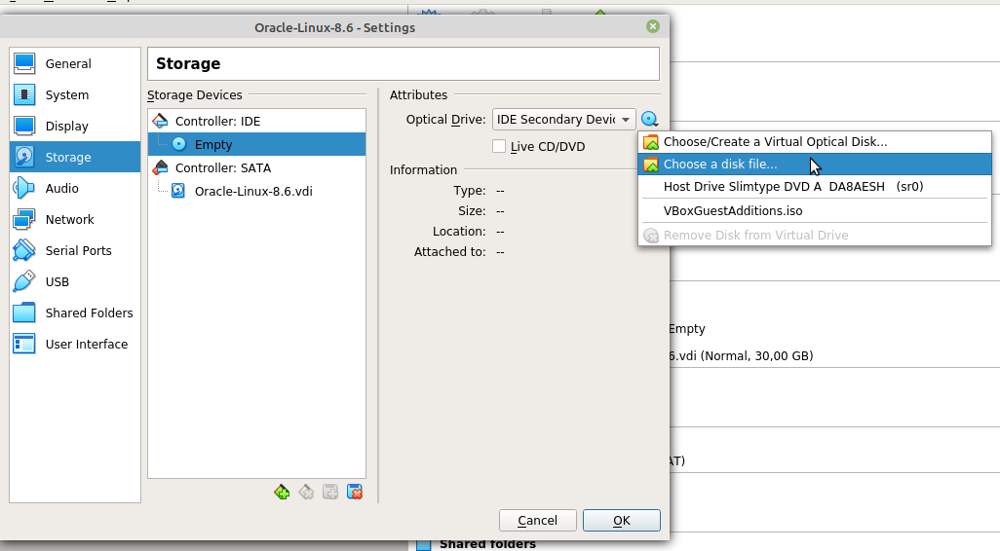

# Atividade 7 - DevSecOps - Linux

O principal foco desta atividade é configurar e instalar uma máquina virtual (VM) do Oracle Linux 8.6 no VirtualBox.
Compass.uol - DevSecOps

# Indice   
  [Obtendo o Oracle Linux 8.6](#obtendo-o-oracle-linux-86)  
  [Criando a máquina virtual Oracle Linux no VirtualBox](#criando-a-máquina-virtual-oracle-linux-no-virtualbox)  
  [Instalando o Oracle Linux](#instalando-o-oracle-linux)  
  [Snapshots](#snapshots)  
  [Configurando relação de confiança entre VMs](#configurando-relação-de-confiança-entre-vms)    
  &emsp;[Configurando IP estático](#configurando-ip-estático)  
  &emsp;[Configurando a relação de confiança](#configurando-a-relação-de-confiança)  

# Obtendo o Oracle Linux 8.6

A iso do Oracle Linux 8.6, assim como outras versões do sistema, pode ser obtida no [site da Oracle](https://yum.oracle.com/oracle-linux-isos.html). 
Realizado o download da iso, podemos avançar para a etapa de criação e instalação da VM.

# Criando a máquina virtual Oracle Linux no VirtualBox

Na tela inicial do VirtualBox, clique em New, ou utilize o atalho Ctrl+N. Realizaremos algumas etapas para criar a máquina virtual.  

1. Dê um nome para a VM. Após selecionar as opções que correspondem ao Oracle Linux, clicar em Next.  
2. Agora deve-se escolher a quantidade de memória RAM alocada para a VM. O recomendado é alocar no mínimo 2048 MB (2GB) para a VM. Definida a quantidade de RAM alocada, clicar em Next.  
3. Nessa etapa o VirtualBox pergunta se desejamos criar um disco rígido virtual ou usar algum já existente. Mantenha a opção padrão, `create a virtual hard disk now`. Clicar em Next.  
4. O VirtualBox deseja saber qual o tipo de disco rígido virtual você deseja criar. Caso você tenha a intenção de usar essa máquina virtual em outro software de virtualização, escolha a opção VHD. Caso contrário, a opção VDI pode ser mantida. Clicar em Next.  
5. Agora você deve escolher se o seu disco rigido virtual será alocado dinamicamente ou terá tamanho fixo. A primeira opção é mais recomendada, pois desta forma o disco vai crescendo de acordo com o seu uso. Assim como também diminuirá se você liberar espaço nele. Definida a opção desejada, clicar em Next.  
6. Por último, devemos escolher o tamanho que esse disco rígido virtual terá. Na atividade foram definidos 30 GB de disco. Clicar em Create.  

A máquina virtual foi criada. Agora devemos fazer algumas configurações nessa VM. Para isso, clique em Settings (ou usar o atalho Ctrl+S).  
Aqui podemos fazer algumas configurações interessantes. Por exemplo, em `System > Motherboard` podemos alterar a quantidade de memória alocada para a máquina virtual.  
Uma etapa essencial é carregar na máquina virtual a iso do Oracle Linux que foi baixada anteriormente. Para isso, vamos em `Storage`  

<p align="center">
  
</p>

Selecionamos a iso do Oracle Linux, que baixamos anteriormente.   

Outra configuração importante é a da rede da máquina virtual. Para configurá-la, basta ir em `Network`. Em `Adapter 1`, vamos em `Attached to` e selecionamos a opção `Bridge Adapter`. Desta forma, nossa VM terá conexão com a internet, utilizando o driver de rede do Host, ou seja, da máquina que está rodando o VirtualBox.  

Feitas essas configurações, clique em Ok. De volta à tela inicial do VirtualBox, podemos selecionar nossa VM e clicar em `Start`.  

# Instalando o Oracle Linux

Pressione a tecla Enter na opção `Install Oracle Linux 8.6.0`.  
#### 1. Selecionando o idioma do sistema operacional
A primeira etapa é selecionar o idioma. É uma boa práticar instalar o sistema operacional em inglês, pois dessa forma podemos obter novas atualizações de forma mais rápida. Portanto, selecione `English (United States)`.  

#### 2. Selecionando o idioma do teclado
Em `Keyboard Layout`, clica no sinal de +. Procure a opção `Portuguese (Brazil)` e clique em `Add`. Selecione a opção `English (US)` e clique no sinal de `-`. Clique em `Done`.

#### 3. Configurando data e hora do sistema
Selecione a região Américas e a cidade que melhor se encaixa na sua situação. Nesta atividade, foi selecionada a cidade de São Paulo, horário de Brasília. Clique em `Done`.  

#### 4. Selecionando o tipo de instalação
Prosseguindo em nossa instalação, devemos selecionar o tipo de instalação que desejamos para o sistema operacional. Em `Software Selection`, selecione a opção `Minimal Install`. Ou seja, estamos instalando o Oracle Linux sem interface gráfica. Clique em `Done`.  

#### 5. Selecionando disco de instalação
O próximo passo é selecionar o disco no qual será feita a instalação do Oracle Linux. Para isso, vamos na opção `Installation Destination`. Em `Local Standard Disks`, selecionamos o disco disponível, que foi o disco que criamos alguns passos atrás. Em `Storage Configuration`, podemos selecionar a opção 
`Automatic`, na qual o próprio sistema decide o tamanho das partições que serão criadas no disco, ou a opção `Custom`, na qual nós criamos as partições de acordo com nossas preferências. Nessa atividade, a escolha foi pela opção automática.  

#### 6. Configurando rede e host name
Em `Network & Host Name`, selecione o dispositivo de rede disponível e o habilite, clicando no botão `OFF/ON`. Mais abaixo também é possível alterar o Host Name. Feitas as configurações, clicar em Done.  

#### 7. Criando senha do root e novos usuários
Por último, em `Root Password`, podemos definir a senha do usuário root do sistema. Digite uma senha forte e, ao final, clique em Done. Agora também temos a opção de criar outro usuário. Se desejar esta opção, basta preencher as informações que são pedidas. Uma das opções é a de dar direitos de administrador para este novo usuário. Criado o usuário, basta clicar em Done.  

#### 8. Concluindo instalação
Após as etapas acima, já podemos iniciar a instalação do Oracle Linux. Clicar em `Begin Installation`. O processo de instalação levará alguns minutos para ser concluído. Quando o processo terminar, devemos reiniciar o sistema. Clicar em `Reboot System`. Nossa máquina virtual com o Oracle Linux 8.6 está pronta para ser utilizada.  


# Snapshots
Neste momento, o uso de snapshots já começa a ser interessante. O snapshot é uma poderosa ferramenta do VirtualBox. Por meio dos snapshots, conseguimos salvar as configurações e dados atuais do sistema. Desta forma, depois podemos restaurar todo o sistema para o exato ponto em que o snapshot foi criado.  
Os snapshots devem ser utilizados com moderação. O acúmulo de snapshots pode fazer com que a VM se comporte de forma inadequada, além de ser um desperdício de espaço. Os snapshots não são recomendados para restaurações de longo prazo.  
Os snapshots são especialmente úteis antes de realizar atualizações, configurações, testes. Em caso de algo errado acontecer, basta restaurar o sistema para o último snapshot criado.  
Para criar um snapshot, basta ir em `Machine > Take Snapshot`, ou utilizar o atalho `Host+T`.  

# Configurando relação de confiança entre VMs
Por meio do procotolo SSH (Secure Shell), podemos nos conectar a outra máquina de forma remota. Nesta atividade, foi proposto que se faça a configuração de relação de confiança entre duas VMs. Através da relação de confiança, podemos nos conectar a um servidor remotamente sem que seja necessário digitar a senha do servidor.  
Primeiramente, é interessante que as duas VMs recebam endereços IP estáticos, pois desta forma é garantido que não perderemos a conexão por causa de uma mudança no IP dinâmico de uma das máquinas.

### Configurando IP estático

Podemos conferir os detalhes da(s) nossa(s) interface(s) de rede utilizando o comando `ip route`. Um exemplo de saída desse comando seria  
```
default via 192.168.1.1 dev enp0s3 proto dhcp src 192.168.1.107 metric 100  
192.168.1.0/24 dev enp0s3 proto kernel scope link src 192.168.1.107 metric 100
```

- 192.168.1.1 é o gateway da rede
- enp0s3 é a interface de rede.
- 192.168.1.107 é o endereço IP da VM
- 192.168.1.0 identifica o endereço IP da rede.
- /24 é a máscara de rede. Significa que a máscara da rede é 255.255.255.0. Ou seja, os 3 primeiros octetos do endereço IP identificam a rede. O ultimo octeto identifica os hosts dessa rede. A VM, por exemplo, é o host 107.    

Sabendo desses detalhes, podemos configurar um endereço IP estático para a nossa VM. Os arquivos de configuração das interface de rede do Oracle Linux ficam no diretório `/etc/sysconfig/network-scripts/`. Esse diretório contém arquivos com nome `ifcfg-nome_do_dispositivo`. Como visto acima, nossa rede está configurada na interface **enp0s3**. Existem algumas formas de configurar a rede no Linux. Nesta atividade, a opção foi pela ferramente `nmcli`.

Nossa interface será configurada da seguinte forma:  
- IPADDR=192.168.1.120 (escolha um IP válido na sua rede)
- NETMASK=255.255.255.0
- GATEWAY=192.168.1.1
- DNS1=192.168.1.1
- DNS2=8.8.8.8  

O comando para configurar a rede através do nmcli é  
```
nmcli connection modify enp0s3 ipv4.address 192.168.1.120/24 ipv4.gateway 192.168.1.1 ipv4.dns "192.168.1.1 8.8.8.8" ipv4.method manual
```

Agora reniciamos a conexão com o comando `nmcli connection up enp0s3`. Podemos conferir se as mudanças foram feitas através do comando `ip address`.  
Também podemos ler o arquivo `/etc/sysconfig/network-scrips/ifcfg-enp0s3` para conferir se as mudanças foram aplicadas corretamente.

### Configurando a relação de confiança

Após realizar nas duas VMs as configurações da seção anterior, podemos configurar a relação de confiança entre elas.  
A relação de confiança é baseada no uso de chaves públicas. Uma chave pública é gerada na máquina A e copiada para a máquina B. A partir disso, a conexão via SSH de A para B não exigirá mais o uso de senha, pois a autenticação da conexão é feita pelas chaves públicas que as máquinas compartilham.  
As VMs possuem as seguintes características:

|VM | Usuário | IP          |
|---|---------| ----------- |
|1  | ricardo |192.168.1.120|
|2  | thadeu  |192.168.1.150|

Para gerar a chave pública na VM 1, utilizamos o comando  
```
ssh-keygen -t rsa
```
Pressione a tecla `Enter` para as perguntas que são feitas. As chaves pública e privada foram geradas. Agora precisamos copiar a chave pública para a VM 2. Para isso, é necessário o comando  
```
ssh-copy-id usuario@ip
```
No caso dessa atividade, ficaria  
```
ssh-copy-id thadeu@192.168.1.150
```
Agora é necessário digitar a senha de acesso do usuário thadeu. Após isso, a senha foi copiada para a VM 2. Teste a conexão SSH  
```
ssh thadeu@192.168.1.150
```
Note que a senha de acesso não foi exigida. A relação de confiança foi configurada. Agora basta repetir o processo da VM 2 para a VM 1.
